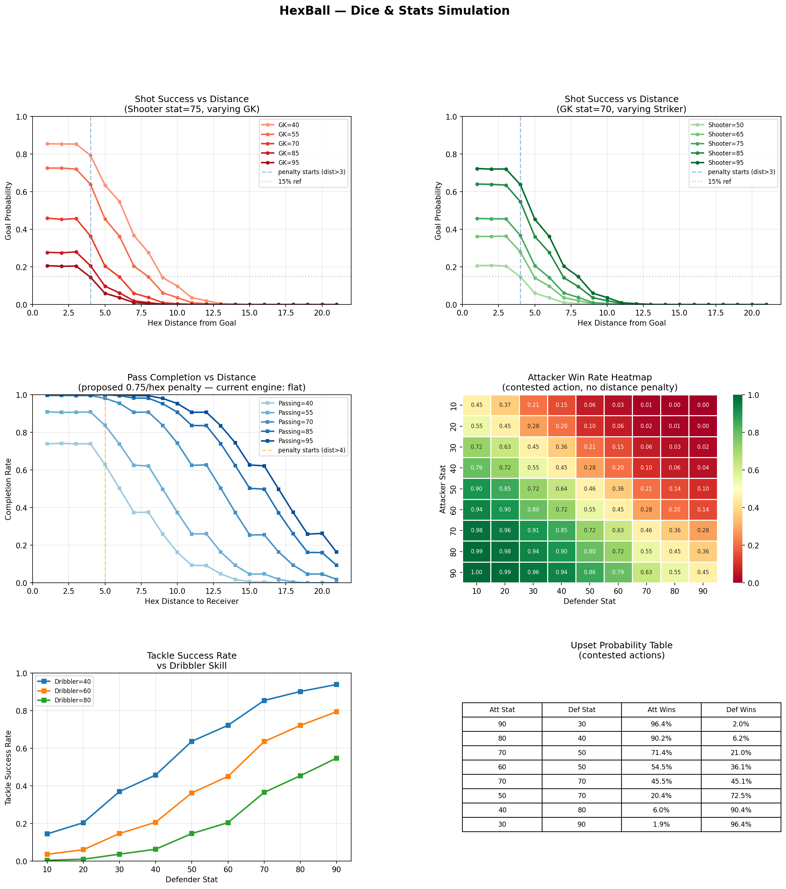

Every football game has to answer one question early: how much should skill matter vs luck?

Get it wrong one way and you've built a spreadsheet — the better team always wins, nothing interesting ever happens, and there's no point playing out the match. Get it wrong the other way and you've built a slot machine — results are chaos, player quality is meaningless, and tactics don't actually matter.

HexBall uses dice to resolve contested actions — tackles, shots, passes under pressure. So I had to get this right before anything else.

---

## Why dice at all?

I wanted every action to have a *known risk* before you commit. You can see the numbers. You know your striker has a 70 shooting stat and the keeper is a 55. Before you pull the trigger you can work out roughly what you're getting into. That transparency felt important — it's a tactics game, not a mystery box.

The question was just: which dice?

---

## The simulation

I ran Monte Carlo simulations across three models — d20 (flat distribution), 2d6, and 3d6 — and tuned until the outcomes felt right. The targets I was aiming for:

- **Equal teams** → roughly 50/50 win rate
- **Elite striker (stat 85+) vs average keeper (stat 55)** → scoring maybe 50–60% of close shots, dropping off sharply with distance
- **Upsets** → the weaker team should win 5–15% of the time. Enough to matter. Not enough to feel broken.

Here's what came out:

---

## What the charts show

A few things jumped out once I had the data.

**Distance kills your shot.** Even an elite striker (stat 95) against a weak keeper (stat 40) goes from ~85% at point-blank to basically nothing by hex distance 10. That's intentional — it forces you to actually build attacks and work the ball into dangerous positions rather than just launching shots from anywhere.

**Skill gaps are real but not cruel.** A 90-stat attacker vs a 30-stat defender wins 96% of duels. Sounds dominant — but a 70 vs 70 matchup lands at about 45% for the attacker (slight defender advantage built in). And even the 30-stat player beats the 90-stat one 1.9% of the time. That 1.9% is the magic — it means every duel matters, and sometimes your tidy centre-back gets nutmegged by a League One reject.

**3d6 won.** The bell curve is the reason. Flat d20 swings too wildly — upsets were too common and skill felt irrelevant. 2d6 was better but the distribution peaked too sharply. 3d6 gives you that satisfying middle ground: most of the time the better player wins, but the tails are fat enough that football happens.

---

The dice model hasn't changed since I locked it. Everything else in the engine has been built on top of it.

Next post: the reaction system — where the game stops being dice-rolling and starts feeling like actual football tactics.
