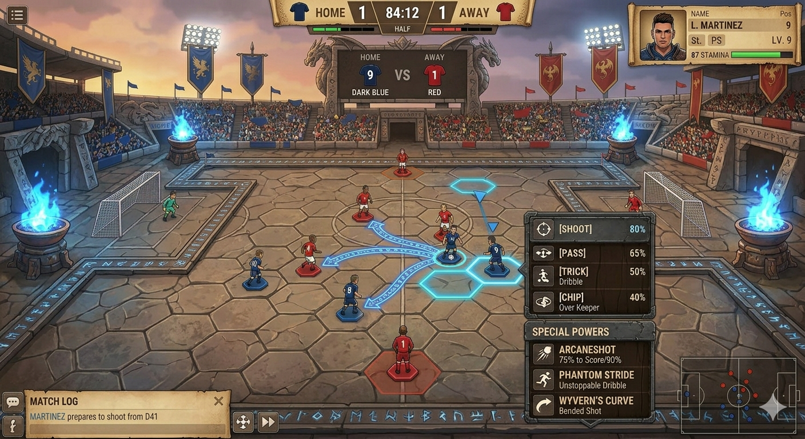
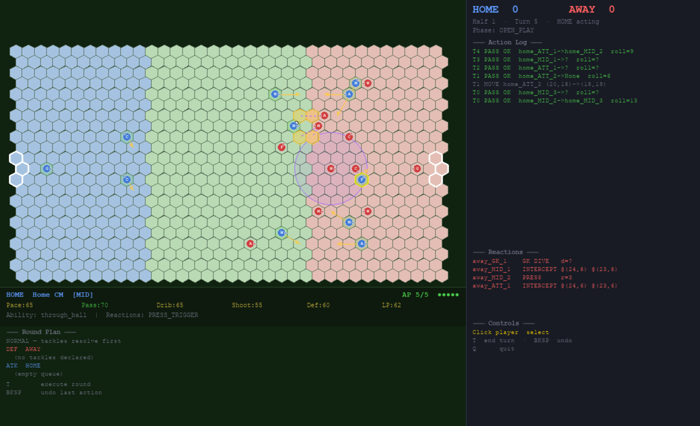
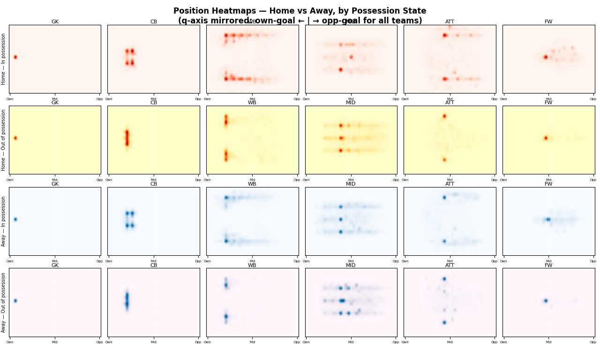
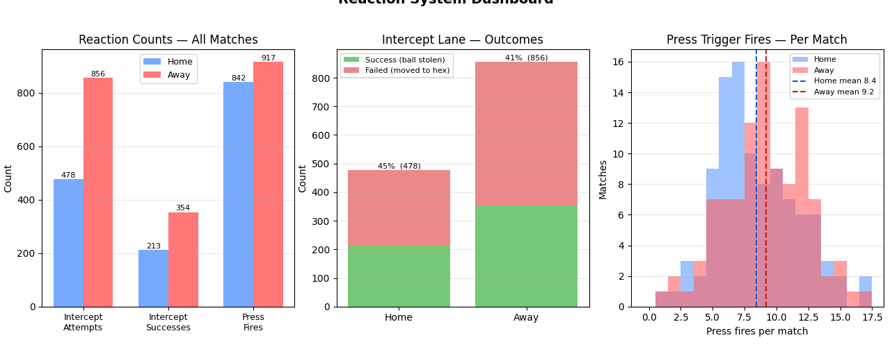

Have you ever watched a football game and thought the manager was shite and you can come up with better tactics? Or have you played Fifa (oh sorry EA FC) and thought damn, I wish I had better control of the tactics? Or have you just caught the world cup fever and can't get enough of football?

I know I have — and as a fix, I decided to build my own football tactics game. I want to build something which I can take my time with, make me feel like a genius tactician, or as a functioning adult just take my eyes off to talk to my wife — so the solution: combining the strategic depth, planning and chill of a turn-based RPG with the action, randomness and stochasticity of football. That's how HexBall was born!

But of course I'm a machine learning nerd, so it should definitely have stats, visualizations, smart AI and all that fun stuff.

---

  

    
<strong>What I thought I'd build 😎</strong>

    
    <figcaption style="font-size:0.8rem; text-align:center; margin-top:0.3rem; opacity:0.7;">Nanobanana's rendering of my game vision</figcaption>
  

  

    
<strong>What it actually looks like 😜</strong>

    <figure style="margin:0 0 0.75rem 0;">
      
      <figcaption style="font-size:0.8rem; text-align:center; margin-top:0.3rem; opacity:0.7;">Gameplay window</figcaption>
    </figure>
    

      <figure style="margin:0;">
        
        <figcaption style="font-size:0.8rem; text-align:center; margin-top:0.3rem; opacity:0.7;">Positioning heatmap</figcaption>
      </figure>
      <figure style="margin:0;">
        
        <figcaption style="font-size:0.8rem; text-align:center; margin-top:0.3rem; opacity:0.7;">Reaction system stats</figcaption>
      </figure>
    

  

---

Never mind, we'll get there! Here is the simulation mode in action, where we can watch AI play against each other:

<video width="100%" autoplay muted loop playsinline style="border-radius:8px; margin:1rem 0;">
  <source src="assets/images/Hexball_sim.mp4" type="video/mp4">
</video>

---

## What's in it

**A hex grid.**
Fluid movement, better understanding of influence zones for defence and just plain looks better.

**All the actions you'd expect, and a few you wouldn't.**
Move, pass, long pass, shoot, tackle — the basics are there. But also: through balls, power shots, slide tackles, a goalkeeper with a sweeper punch, and a press trigger that lets your midfield hunt in packs. 

**A reaction system, because defending shouldn't be passive.**
Before each attacking turn, defenders can pre-declare what they're going to do. Your goalkeeper commits to a dive direction. A midfielder declares an intercept lane. It adds a bluffing layer — do you telegraph your press and hope you read it right, or stay cautious?

**Dice that actually feel fair.**
Transparent dice based resolution, every move has a chance of failure, but you know the risks before you commit! Will you be brave enough to make that risky pass or play it. 

**An AI opponent that actually thinks.**
The AI uses influence maps to evaluate space, scores positions across the whole pitch, and plans a couple of moves ahead. You can beat it easily right now, but wait for the self-play trained RL agent :exploding_head:

**Stats and dashboards, because of course.**
Every match logs to JSONL. There are scripts to visualize stats and understand what happened in the gaem. You can run 50 headless simulations and see exactly why your team keeps losing on the left flank. Goal is to let AI use this simulation to better plan, play against itself and get really really smart!

---

## Devlog

Check the [Blog](/hexball/blog) for development updates, design decisions, and lessons learned.
